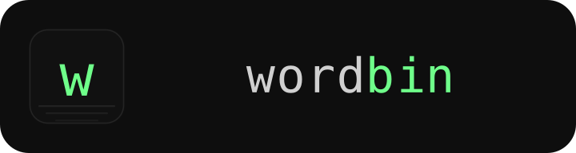
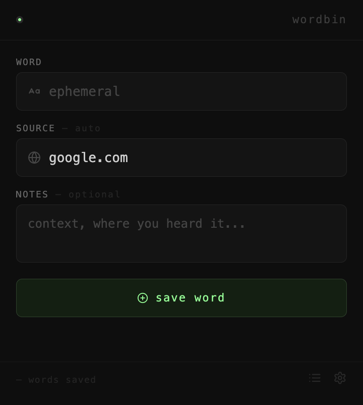
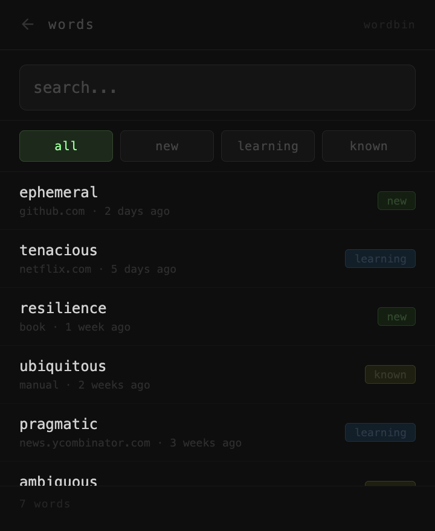
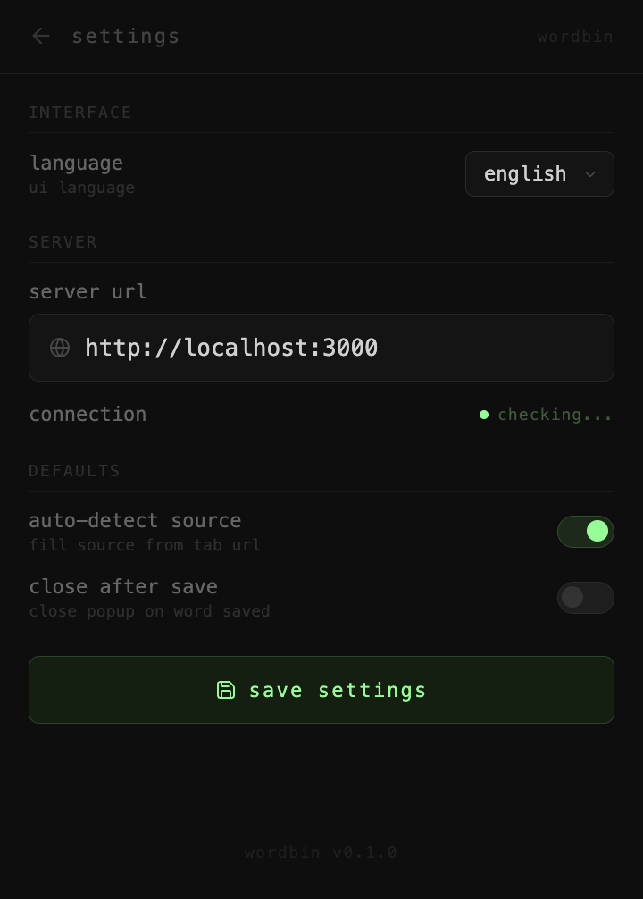

<p align="center">
  
</p>

# wordbin

> One place to drop English words you don't know yet.

<p align="center">
  
  
  
</p>

I encounter unknown words everywhere — subtitles, browser tabs, podcasts, books. Every tool I tried solved one source but not the others. I ended up with words scattered across a phone app, a browser extension, and a notebook that I never actually reviewed.

Wordbin is a self-hosted daemon that gives me a single endpoint to send words from anywhere. A browser extension for the web, a CLI for the terminal, whatever else later. Everything lands in one SQLite file.

---

## What it is

- **wordbin-server** — Axum daemon, exposes a REST API, stores words in SQLite
- **wordbin-extension** — Browser extension (Leptos/WASM) to capture words while browsing
- **wordbin-types** — Shared types between server and clients

## What it is not

- A flashcard app (yet)
- A SaaS
- Stable

---

## Architecture

```
┌───────────────┐    POST /word/add    ┌─────────────┐
│   Extension   │ ───────────────────▶ │   Server    │ ──▶ SQLite
│ (Leptos/WASM) │ ◀─── GET /active ─── │   (Axum)    │
└───────────────┘                      └─────────────┘
        ▲                                     ▲
        └──── shared types: wordbin-types ────┘
```

---

## Features

- Capture words from any browser tab — source auto-fills from hostname
- Three pages — quick capture, full word list, settings
- 4 UI languages — en / ru / de / fr
- OpenAPI docs auto-generated, Swagger UI at `/swagger-ui`
- Single binary, SQLite as the only runtime dependency

---

## Stack

- **Server** — Rust, Axum, SQLite via sqlx
- **Extension** — Rust, Leptos, WASM
- **Config** — TOML via figment
- **Docs** — Swagger UI via utoipa

---

## Running the server

```bash
git clone https://github.com/Vancoola/wordbin
cd wordbin/server
cargo run
```

Config is read from `App.toml` in the project root:

```toml
[server]
port = 3000
host = "0.0.0.0"
tracing_level = "INFO"
```

Swagger UI available at `http://localhost:3000/swagger-ui`.

---

## Building the extension

```bash
cd wordbin-extension
wasm-pack build --target web --out-dir dist/pkg --release
cp manifest.json index.html popup.css bootstrap.js dist/ && cp -r icons dist/
```

Then load `wordbin-extension/dist/` into Chrome:

1. Open `chrome://extensions`
2. Toggle **Developer mode** (top right)
3. Click **Load unpacked**, select the `dist/` directory

---

## Roadmap

- [x] Capture endpoint + extension popup
- [x] Settings page with i18n
- [ ] Words list view
- [ ] Spaced-repetition review flow (table already in schema)
- [ ] Auth — bearer token from config
- [ ] Telegram client (bot)
- [ ] CLI client
- [ ] Docker image
- [ ] Tauri client 

---

## Status

Active development since May 2026. Schema will change. Built for myself — issues and PRs welcome, no guarantees.

---

## License

Apache-2.0
